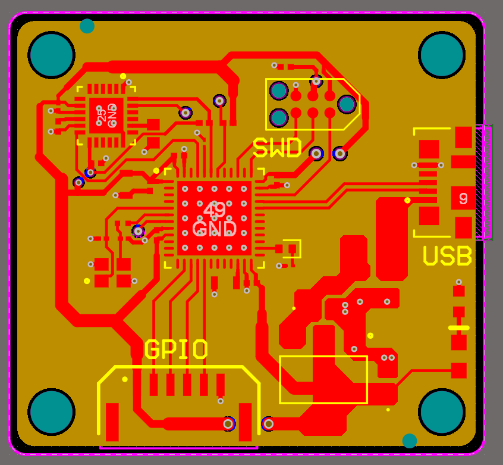
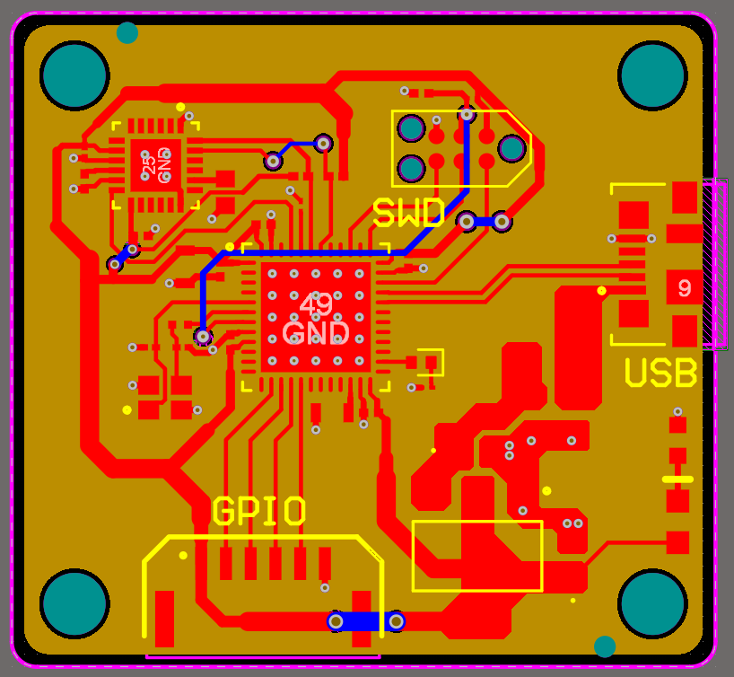
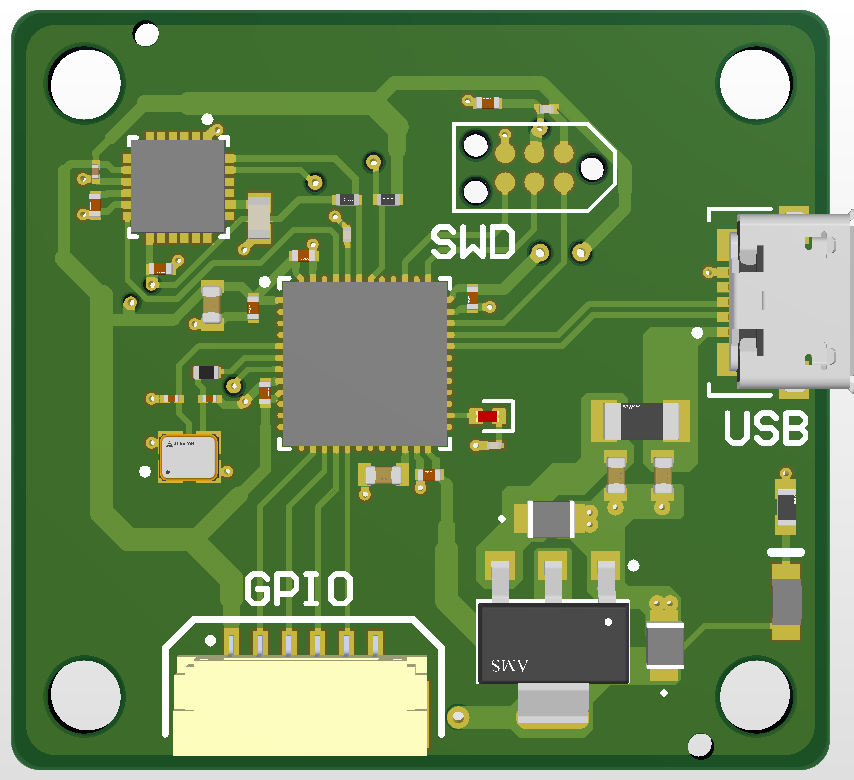
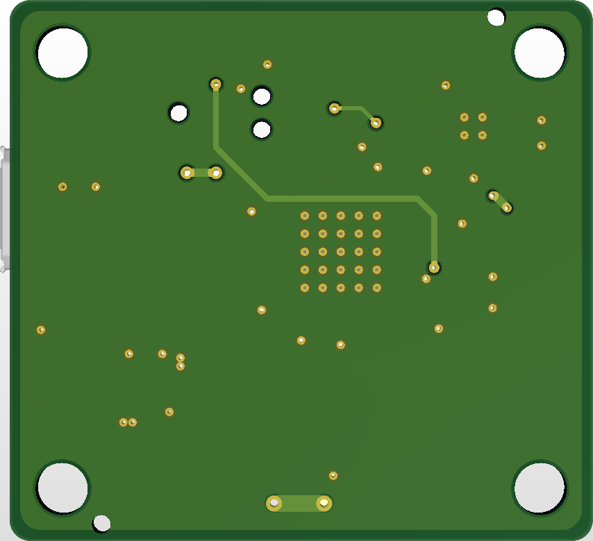
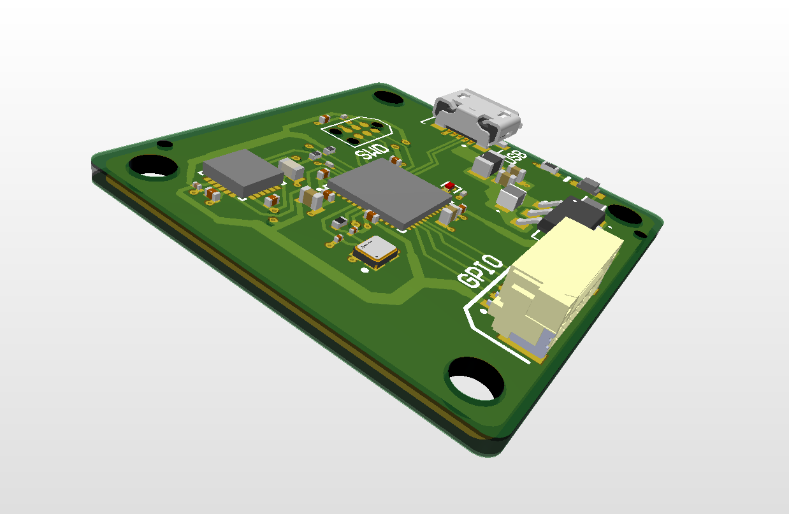

## STM32 with IMU and USB [PCB DESIGN]

This is a 4-layer (SIG-GND-GND-SIG) PCB designed for an STM32F411CEU6 microcontroller for applications requiring MPU-6050, primarily designed using Altium Designer and STM32CubeIDE. This PCB is impedance-matched to 90Ω for USB. 
This design uses the I²C protocol to connect peripheral modules (MPU-6050). I have also included a GPIO connector, as well as an STM32 debug connector. 
Also includes a 5V-3.3V DC regulator, to carry power from the USB connector to the microcontroller, but lacks ESD protection as it was deemed unnecessary for lower-frequency applications. 

  
  
  
  
  

